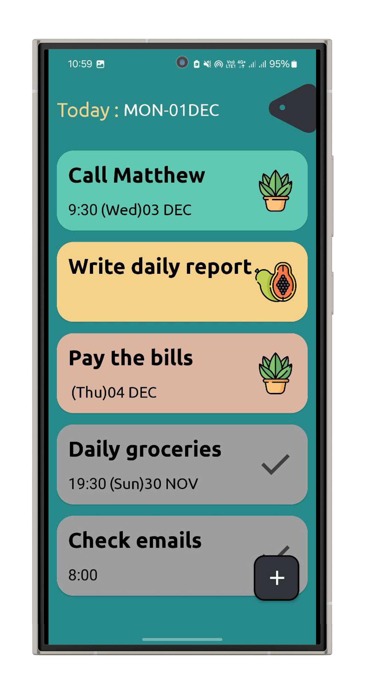
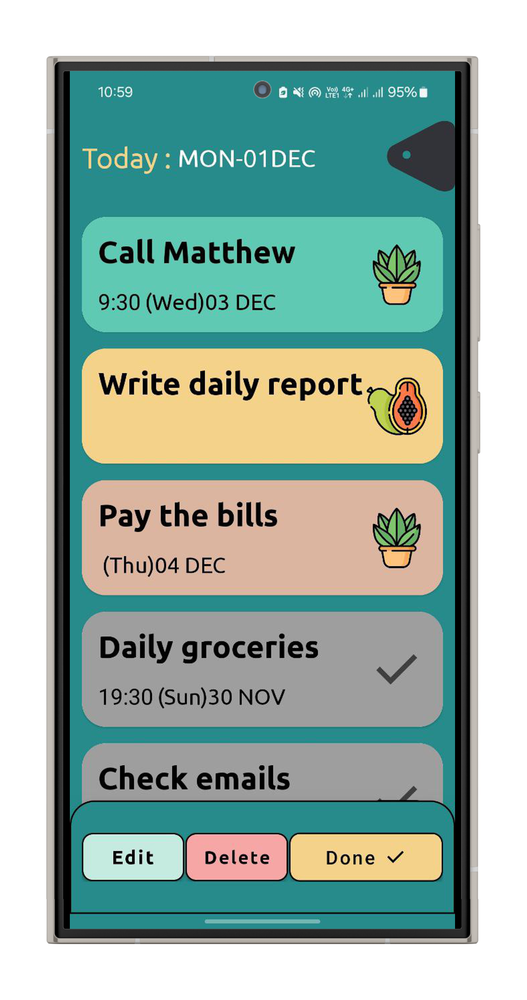
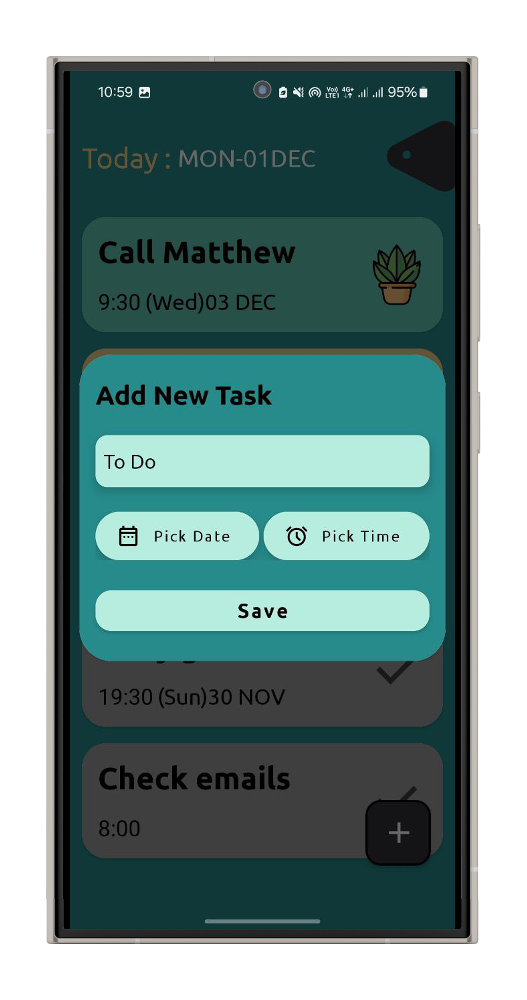
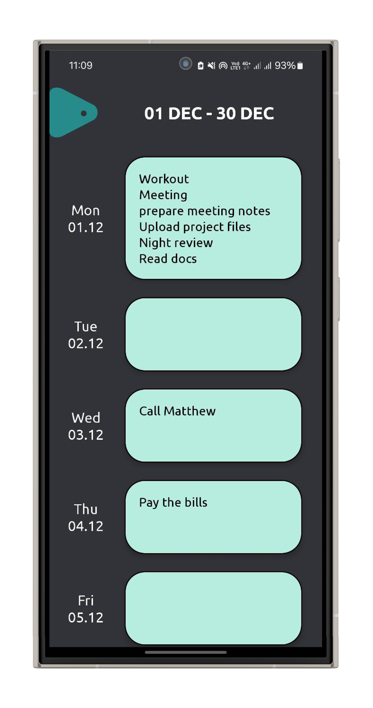

# 🚀 DoDoApp: Minimal Task Manager for Android

This is a simple **To-Do List** application built with Java for my portfolio. The main goal was to create a clean, easy-to-use app that focuses on core task management features and good UI design using Material Components.

## ✨ Key Features

* **CRUD Operations:** Easily **Add, Edit, and Delete** tasks.
* **Scheduling:** Set a specific **Date and Time** for any task using Material Pickers.
* **Visual Status:** Users can mark tasks as **Completed** (Done).
* **30-Day Calendar View:** A separate screen to view all tasks scheduled for the next month.
* **Aesthetic Design:** Clean and appealing UI that uses custom background colors and stickers for visual separation of tasks.

## 🛠️ Technology Stack

The project uses standard Android development tools and libraries:

* **Language:** Java
* **Database:** Android Jetpack **Room** (Used for local data storage).
* **UI/Design:** Google **Material Design Components** (e.g., Material Pickers, Material Cards).

## ⚠️ Important Note on Code Structure

This project currently uses a basic **Activity-as-Controller** architecture. All database operations (like saving and reading tasks) are executed **synchronously** on the main thread.

* **Why this matters:** This can cause slow performance (UI lag) if the database grows very large.
* **Future Work:** The next steps for this project include migrating to a modern **MVVM (Model-View-ViewModel)** architecture and using **Coroutines/LiveData** for proper background threading.

## ⚙️ How to Run

1.  Clone the repository to your local machine:
    ```bash
    git clone (https://github.com/Maatthyou/Minimal-Android-Task-Manager)
    ```
2.  Open the project in **Android Studio**.
3.  Build and run the app on an emulator or a physical Android device (API 21+).

4.  ---
  ## Screenshots

### First Screenshot


### Second Screenshot


### Third Screenshot


### Fourth Screenshot


